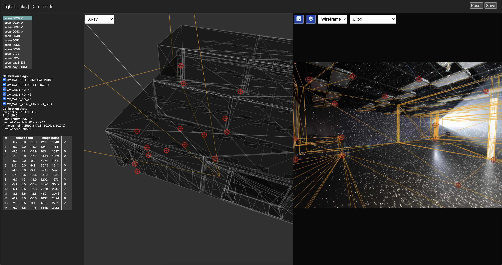

# Camamok JS

This is a port of an app originally built in openFrameworks. It allows you to load an image from a camera, and a 3d model of the space the photo is taken in, and map the 3d model to the image. Camamok will then output a binary file that contains the world xyz coordinates from the 3d model for each pixel in the picture.



## Run

Install dependencies by running `npm install` and then start the server and build the typescript code with `npm run dev`.

The server can also be started from the Lightleaks docker image by running 

```
bin/camamok
```
